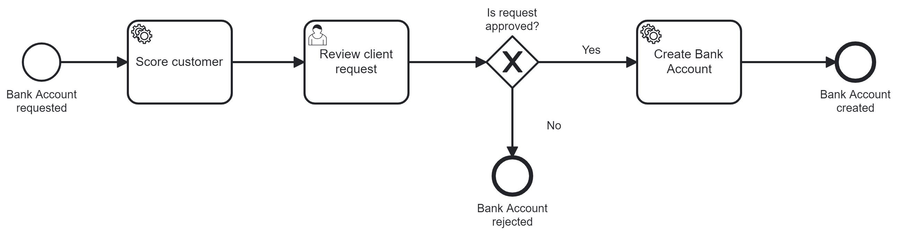
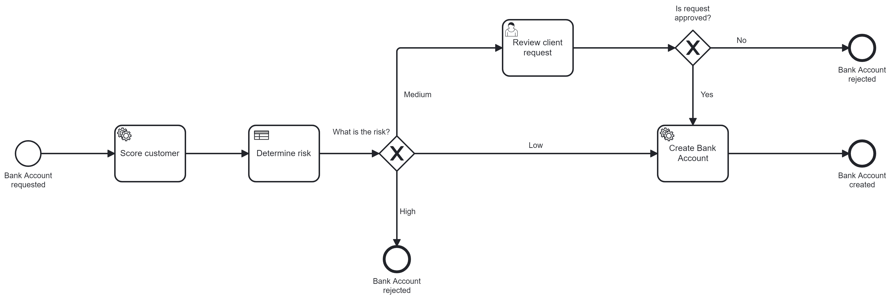

# Customer Onboarding Process

This following stack is used:

* Camunda Platform 8
* Java 17
* Spring Boot 3

# Intro

This simple onboarding process is meant to get started with process automation, workflow engines and BPMN.

The process model contains three tasks:

* A service task that executes Java Code to score customers (using the stateless Camunda DMN engine)
* A user task so that humans can approve customer orders (or not)
* A service task that executes Java Code to create bank account

The process solution is a Maven project and contains:

* The onboarding process model as BPMN
* Source code to provide a REST endpoint for clients
* Java code to do the customer scoring
* Java code to create bank account

## Create Camunda Platform 8 Cluster

The easiest way to try out Camunda is to create a cluster in the SaaS environment:

* Login to https://camunda.io/ (you can create an account on the fly)
* Create a new cluster
* Create a new set of API client credentials
* Copy the client credentials into `src/main/resources/application.properties`

## Run Spring Boot Java Application

The application will deploy the process model during startup

`mvn package exec:java`

## Play

You can easily use the application by requesting a new customer onboarding posting a PUT REST request to 

`curl -X PUT http://localhost:8080/customer`

You can now see the process instance in Camunda Operate - linked via the Cloud Console.

You can work on the user task using Camunda Tasklist, also linked via the Cloud Console.

# Extended Process

There is also an extended process model that adds some more tasks in the process: 

